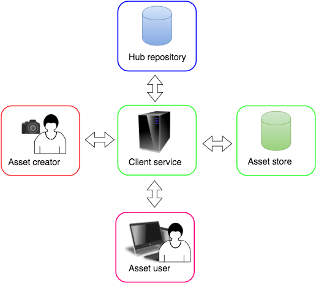

# How to use the Onboarding Service

## Contents

+ [Acronyms](#acronyms)
+ [About this document](#about-this-document)
+ [Overview](#overview)
+ [API status in the current release](#api-status-in-the-current-release)
+ [Assets](#assets)
+ [Hub Keys](#hub-keys)
+ [Offer IDs](#offer-ids)
+ [Batch onboarding](#batch-onboarding)
+ [The Onboarding Service REST API](#the-onboarding-service-rest-api)
+ [Python onboarding example](#onboarding-examples)
+ [Embedding Hub Keys in an image](#embedding-hub-keys-in-an-image)
+ [Onboarding edge cases](#onboarding-edge-cases)
+ [Example user story](#example-user-story)

## Acronyms

| Acronym | Description               |
| :------ | :----------               |
| OPP     | Open Permissions Platform |

## About this document

This How-to describes how to onboard assets using the Open Permissions Platform
Onboarding Service.

For issues and support, contact
[support@openpermissions.org](mailto:support@openpermissions.org)
by email.

### See also

+ Calls to the Onboarding Service must be authenticated, see
[How to authenticate with Open Permissions Platform services](
https://github.com/openpermissions/auth-srv/blob/master/documents/markdown/how-to-auth.md).

## Overview

The OPP Onboarding Service enables application clients to upload asset
data to the platform, and link assets to offers.

OPP constructs a unique Hub Key for each onboarded asset. The Hub Key
is returned to the caller, and can be used in subsequent queries to
the platform.

The Onboarding Service is exposed as a REST API.

Note that OPP **does not** onboard content. When an asset is
onboarded, data *about* the asset is uploaded to an OPP repository;
the asset file itself (e.g. an image or media file) is **not**
uploaded, but remains in the uploader's own repository.

For full API details, see the
[Onboarding Service API Reference](../apiary/api.md).

## API status in the current release

The Onboarding Service is live in the **current release**.

The service supports individual and bulk uploading (including bulk
uploads for many thousands of items) of CSV or JSON data.

### Limitations

+ For performance reasons, an advisory limit of ~30k CSV lines or JSON
  equivalent is recommended for batch onboarding, with a maximum
  JSON/CSV file size of 11MB

## Assets

In OPP terminology, a copyright work is an *asset*. There is an almost
unlimited variety of possible kinds of asset. Because the platform
does not onboard content it is agnostic about asset types, so long as
a recognised type ID is supplied in the onboarding data.

Typically, the data supplied when an asset is onboarded identifies:

+ **source type IDs** &mdash; identify the type of the source assets,
  for example registered
  [proprietary identifier types](https://github.com/openpermissions/support-docs/blob/master/documents/markdown/types/source-id-types.md)
  and globally standard types like ISN or ISBN
+ **source IDs** &mdash; individual identifiers by which source assets
  are known to the onboarder
+ **offers** &mdash; terms under which an asset is made available to
  would-be users
+ **optional descriptive information** &mdash; textual descriptions
  that provide useful but not definitional information about an asset,
  for example titles and captions

*Onboarding* an asset brings this data into the OPP ecosystem.

Note that multiple source type IDs and source IDs are supported for a
single asset when onboarding, allowing assets to have many aliases.

## Hub Keys

Hub Keys are entity IDs embedded into a URL to create unique browsable
URLs. Hub Keys are true URLs that encode enough information to
uniquely identify and locate their referent.

The following is an example of a Hub Key that identifies an asset,
the hub and repository to which it was onboarded:

`https://openpermissions.org/s1/hub1/dcbfd5956ccde508f7a942eb7e03bd13/asset/c46421146c5a4aa68877afe37a75835c`

For details see the
[Hub Key Technical Specification V1](
https://github.com/openpermissions/support-docs/blob/master/documents/markdown/arch/TECHSPEC_V1.md).

## Offer IDs

Offers are terms under which a licensor is willing to make an asset
available to would-be users. Offers are identified by Hub Keys. For
example:

`https://openpermissions.org/s1/chf/1451451435345/offer/2523452354315`

Offers are linked to an asset when the asset is onboarded by supplying
`offer_id` data, or can be merged in at any time afterwards.

## Batch onboarding

The Onboarding Service endpoint supports batch onboarding of assets,
including large batches (but see [Limitations](#limitations) above).

## The Onboarding Service REST API

For full API details, see the
[Onboarding Service API Reference](../apiary/api.md).

### Onboarding assets

Onboarding is typically performed either:

1. "Live" by client services, for example when a user uploads a new
asset to a social network service, and the service in turn onboards
asset data to OPP
2. Or, periodically as a batch process when a new service or content
library is integrated with OPP

For each successfully onboarded asset, the Onboarding Service returns
a Hub Key.

#### Prerequisites

To use the Onboarding Service you must:

+ Register your organisation with the OPP Accounts Service
+ Create a service for your organisation, you will need the service
  **client credentials** to authenticate with OPP
+ Create a repository on an OPP Repository Service, you will need the
  **repository ID** when you onboard

For details see
[How to create and manage accounts, services, and users](https://github.com/openpermissions/accounts-srv/blob/master/documents/markdown/how-to-register.md).

You should also request that platform admins register a **source ID
type** for your organisation or service, contact
[support@openpermissions.org](mailto:support@openpermissions.org).

>Note: To test the Onboarding Service you can use `examplecopictureid`
>as the source ID type until custom asset ID types are assigned, and
>omit offer IDs if you have not yet created offers.

#### Authentication

To authenticate with the Onboarding Service, request an access token
from the Authentication Service with `delegate write` scope for the
repository to which you are onboarding, and supply the token in your
onboarding call. See the [example below](#python-onboarding-example).

Note that your service must have write access to the specified
repository.

For full details see
[How to authenticate with Open Permissions Platform services](
https://github.com/openpermissions/auth-srv/blob/master/documents/markdown/how-to-auth.md).

#### HTTP headers

Supply the following HTTP headers:

**Content Type &mdash; for CSV data**

`'Content-Type': 'text/csv; charset=utf-8'`

**Content Type &mdash; for JSON data**

`'Content-Type': 'application/json; charset=utf-8'`

**Accept**

`'Accept':'application/json'`

**Authorization &mdash; Bearer with access token**

`'Authorization': 'Bearer <bearer_token>'`

#### Data

Send onboarding data in the body of an HTTP `POST` method request as a
CSV or JSON string. Do **not** URL encode the CSV or JSON data string.

+ CSV format is most convenient for batch onboarding data for large
numbers of assets, for example where a CSV file can be exported from
an existing database or catalogue
+ JSON format is most convenient for interactive, application driven
onboarding of asset data

##### CSV data

+ Supply a header row as the first row of your CSV data. The header
row is used to match the fields in the lines of data that follow
+ `source_id_types` and `source_ids` are CSV-only fields. Each
accepts a tilde '`~`' separated list of identifiers of type
`source_id_type` and `source_id` respectively
+ The above two lists must match 1:1 i.e. the 0th `source_id_type` in the
list is the type of the 0th `source_id` in the list
+ Supply `offer_ids` as a tilde '`~`' separated list of one or more
offer IDs. To omit offer information, omit the field value,
with `,,`
+ __Do__ use `source_id_types`, `source_ids`, and `offer_ids` in
CSV data, even where there is only one item in the list.
+ Do __not__ use `source_id_type` or `source_id` in CSV data.

##### JSON data

+ Supply `source_ids` as an array of JSON objects, each of which is a
  `source_id_type`:`source_id` pair
+ Supply `offer_ids` as an array of offer Hub Keys. To omit offer
  information, omit the `offer_ids` property
+ Do __not__ use `source_id_types` in JSON data.

##### Data string examples

The following two Python examples are valid data strings. Note the use
of `json.dumps` to build the JSON object from data in the `json_data`
example:

```python
csv_data = 'source_id_types,source_ids,offer_ids,description\nexamplecopictureid,DSC_00A987,,"Cannubi cru vineyard at sunset, Barolo, Piemonte, Italy"'
```

```python
json_data = json.dumps([{
    'source_ids': [{
        'source_id_type': 'examplecopictureid',
        'source_id': 'DSC_00A987'
    }],
    'description': 'Cannubi cru vineyard at sunset, Barolo, Piemonte, Italy'
}])
```

## Python onboarding example

>Always use staging service endpoints for test and development.

The following Python code onboards the two data examples above to the
repository with ID `<repo_id>`, where `<client_id>` and
`<client_secret>` are the client credentials of the calling
service. The client must have write access to the repository.

```python
import json, requests

repo = <repo_id>
client = <client_id>
secret = <client_secret>

service = 'https://on-stage.copyrighthub.org'
endpoint = '/v1/onboarding'
resource = '/repositories/%s/assets' % repo

# Get an authorization token
r = requests.post('https://auth-stage.copyrighthub.org/v1/auth/token',
    auth=(client, secret),
	data={'grant_type': 'client_credentials',
		'scope':'delegate[https://on-stage.copyrighthub.org]:write[%s]' % repo})

token = r.json()['access_token']

uri = service + endpoint + resource

# CSV example
r = requests.post(uri,
	data=csv_data,
	headers={'Accept':'application/json',
	'Content-Type': 'text/csv; charset=utf-8',
	'Authorization': 'Bearer %s' % token})

print r.text

# JSON example
r = requests.post(uri,
	data=json_data,
	headers={'Accept':'application/json',
	'Content-Type': 'application/json; charset=utf-8',
	'Authorization': 'Bearer %s' % token})

print r.text
```

**Result:**

Executing the above code should produce the following result:

```
{"status": 200, "data": [{"entity_id": "001eea2323ff4bbea7dbdf285397e06b", "source_ids": [{"source_id": "DSC_00A987", "source_id_type": "examplecopictureid"}], "hub_key": "https://openpermissions.org/s1/hub1/dcbfd5956ccde508f7a942eb7e03bd13/asset/001eea2323ff4bbea7dbdf285397e06b", "entity_type": "asset"}]}
{"status": 200, "data": [{"entity_id": "ada1b1d052e24b1cb32c864fdc1c1204", "source_ids": [{"source_id": "DSC_00A987", "source_id_type": "examplecopictureid"}], "hub_key": "https://openpermissions.org/s1/hub1/dcbfd5956ccde508f7a942eb7e03bd13/asset/ada1b1d052e24b1cb32c864fdc1c1204", "entity_type": "asset"}]}
```

##### Errors

Errors are returned as objects containing `status`, `errors`, and
`data` values.

|HTTP Status Code|Likely Meaning|Help|
|---|---|---|
|400|Asset data rejected for reasons specified in the `errors` array|Check you are using valid `source_id_type` values, see [Prerequisites](#prerequisites)|
|401|Authentication failed, check that your access token is valid and has not expired|
|403|Authentication succeeded but the action is not authorised, typically a permissions issue|
|405|Incorrect HTTP header|See [HTTP headers](#http-headers) above|

Some common errors, for example missing or mismatched fields, are
shown below as examples.

####### TBD verify Thu Apr 14 22:38:59 2016 see JIRA Bugs raised

+ Mismatched `source_id_types:source_ids` lists in CSV:

```json
{
	"status": 400,
	"errors": [{
		"source": "transformation",
		"line": 2,
		"message": "source id types does not match that of ids"
	}],
	"data": null
}
```

+ Unregistered `source_id_type`:

```json
{
	"status": 400,
	"errors": [{
		"source": "transformation",
		"line": 2,
		"message": "Invalid source id type MyPictureID"
	}],
	"data": null
}
```

+ Missing or unrecognised fields/properties:

```json
{
	"status": 500,
	"errors": [{
		"source": "transformation",
		"message": "Unexpected error (\"provider_id should match (?:[a-zA-Z0-9\\\\.\\\\-_~!$&'()*+,;=:@]|%[\\\\da-fA-F]{2})+\",)"
	}],
	"data": null
}
```

## Embedding Hub Keys in an image

For an image asset, OPP clients may choose to embed the returned Hub
Key into the image metadata. If so, the Hub Key should be added as the
Copyright field in the IPTC record for the image.

For more about IPTC see
http://www.iptc.org/cms/site/index.html?channel=CH0099. Open source
image metadata manipulation libraries and tools are available from
[Exiv2](http://www.exiv2.org).

## Onboarding edge cases

| Case | Result | Comment |
|---|---|---|
|The "same" asset, e.g. a specific image is onboarded with different asset IDs|Because different asset IDs are supplied, different Hub Keys are generated and the images are treated as different assets. There is nothing to identify these images as being "the same"|Typically, this is the desired behaviour|
|An image is onboarded multiple times with the same asset ID. This may happen if an onboarding request is repeated e.g. a batch script is run twice|Because the same asset ID is supplied, an identical Hub Key is generated. Any differences in other supplied data will be merged|Rerunning a batch process will create no changes if the data has not changed. Individual changed fields will be *added* as additional data without deleting existing data|

## Example user story

An example user story for onboarding image data to OPP might look like
this:



1. Asset creator Nancy is a photographer. She takes a picture and
   uploads it to an OPP client service Acme Images

1. Acme provides an agency service for photographers and publishes
   their work in an online catalogue. As part of its service to Nancy,
   Acme onboards the image to an OPP repository and links it to an
   offer Nancy has previously selected in her Acme profile

1. The OPP Onboarding Service returns a Hub Key to Acme when the image
   is onboarded. Acme stores the Hub Key and the image locally in the
   Acme asset store

1. Asset user Judy is a web designer. Judy browses the Acme catalogue
   and finds the image Nancy uploaded

1. When Judy selects the image, Acme can use either the Hub Key that
   was returned by OPP when the image was onboarded, or the Acme ID
   with which the image was onboarded, to query OPP and retrieve
   offers for use of the image

1. Judy accepts a pay-for-use offer, pays the fee via the Acme cart, and
   downloads and uses the image
